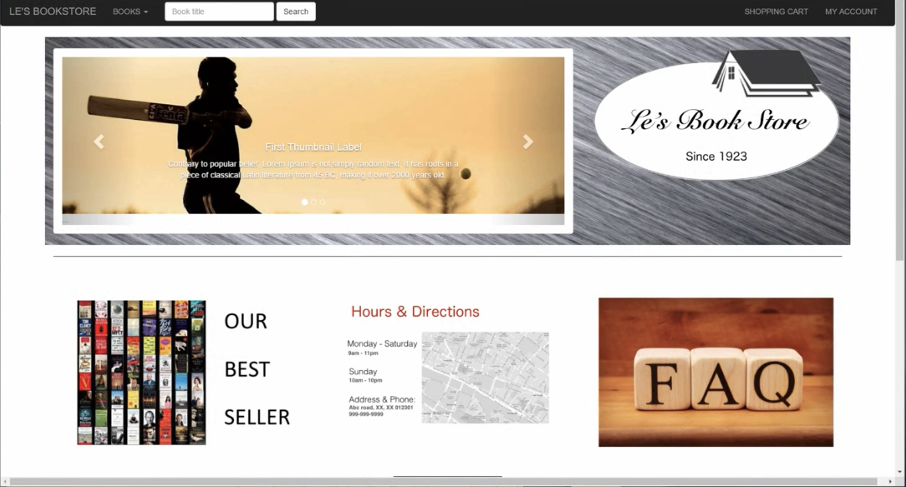

# This project is about an online bookstore, but it is not limited to bookstore. Let's start our tour.
## To have a quick view, the picture below will redirected you to YouTube
[](https://www.youtube.com/watch?v=qGyih1lg-CQ&t=31s)
## High level view of the bookstore:
1. My Account Page: 
   1. My account page is all about `sign up`, `login` and `logout`, in other word: **authentication** and **authorization**.
   I use the spring framework to handle this two part. 
   1. In this part, we focus on the functionality of sign up as new customer, login to get access to the whole website, logout, forget password.
   2. For the CRUD part, we use JPA and Hibernate to handle the data flow
2. Admin Portal:
   1. In the admin portal, you have the authorization for adding books, editing books information and view the shopping orders
3. Bookstore:
   1. This is the main page of this app, here you can see the bookshelf, book detail
4. User Profile:
   1. this is the page about user's information, pay method management, billing info and shipping info
5. Shopping Cart:
   1. this is the page user can manage their transactions. In the backend, we use the service layer to handle the direct service provided to user(both customer and admin), and the DAO layer to handle the data flow(aka CRUD ).
6. Checkout and Submit Order:
   1. this part we will create oder service and set confirm email
7. Side Features:
   1. Viwe order, Search, Delete Books

## How to deploy it:
As spring boot is embeded with Tomcat, you can simply run
1. for the bookstore site:
   ```
   cd Bookstore
   mvn package
   java -jar path/to/the/jarfile.jar 
   ```
2. for the admin site
   ```
   cd adminportal
   mvn package
   java -jar path/to/the/jarfile.jar 
   ```
3. then in your chrome broswer:
   ```
   http://localhost:8080
   ```
after the three procedure above, you can see the page as in the youtube
   